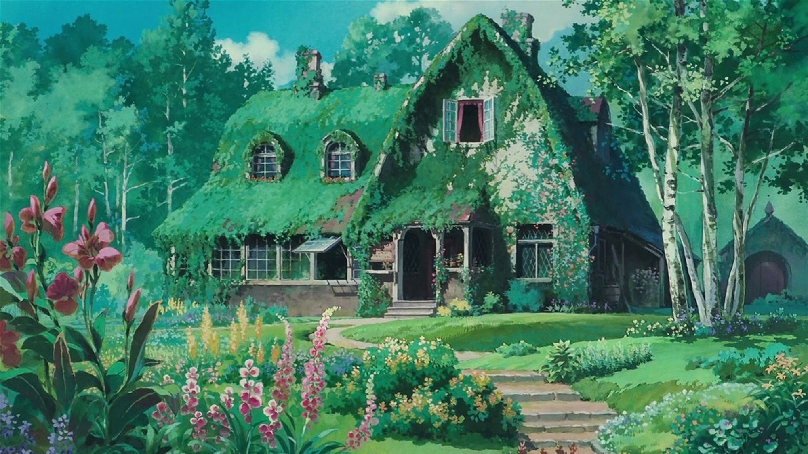

<!-- - 👋 Hi, I’m @JaveleyQAQ
- 👀 I’m interested in ...
- 🌱 I’m currently learning ...
- 💞️ I’m looking to collaborate on ...
- 📫 How to reach me ... -->

<!---
JaveleyQAQ/JaveleyQAQ is a ✨ special ✨ repository because its `README.md` (this file) appears on your GitHub profile.
You can click the Preview link to take a look at your changes.
--->

<!-- "Hero" Header -->

  
   
   
	 
   

   
   
  

<!-- Social -->
<table width="100%" align="center">
<tr>
<td align="center">
<a href="https://javeley.vercel.app">
<strong> </strong>
 

</a>

</td>

<td align="center">
<a href="https://javeley.vercel.app/">
<strong>  </strong>
 

 
</a>

</td>

<td align="center">
<a href="https://javeley.vercel.app/">
<strong>  </strong>
 

 
</a>

</td>

<td align="center">
<a href="https://javeley.vercel.app/">
 

 
</a>

</td>
</tr>

<!-- Social 2 -->

<tr>
<td align="center">
<a href="https://javeley.vercel.app/">

 
</a>

</td>

<td align="center">
<a href="https://javeley.vercel.app/">

 
</a>

</td>

<td align="center">
<a href="https://javeley.vercel.app/">

 
</a>

</td>

<td align="center">
<a href="https://javeley.vercel.app/">

 
</a>

</td>

</tr>
</table>

 

 

<!-- Guestbook -->
| Name | Date | Message |
|---|---|---|
| <a href="https://github.com/JaveleyQAQ"> JaveleyQAQ</a> |1/14/2024, 3:53:13 PM| 哥哥进来玩呀～

<!-- /Guestbook -->

<!-- Footer -->

 

<!-- "margin-right: whatever;" -->
&nbsp;&nbsp;&nbsp;&nbsp;  

&nbsp;&nbsp;&nbsp;&nbsp;  

